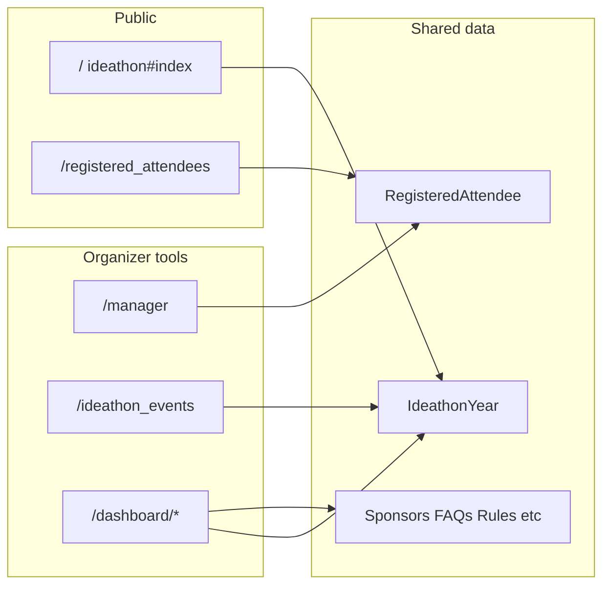

# Admin dashboard and public site — system guide

This guide maps **how the public ideathon site and organizer tools share one Rails app** (`501-plan`). It complements **`docs/user_documentation.md`** (organizers) and **`docs/technical_documentation.md`** (developers).

---

## Architecture overview



- **One database**, one set of models. The **active** `IdeathonYear` (see `ActiveIdeathonYear`) drives what the public homepage shows.
- **Dashboard** modules update content keyed by **year** (`ideathon_year_id`). Touching a child record can refresh the parent ideathon year for ordering and “freshness” logic.

---

## Entry points (code)

| Surface | Controller(s) | Views |
|---------|----------------|-------|
| Public home | `IdeathonController` | `app/views/ideathon/` |
| Registration | `RegisteredAttendeesController` | `app/views/registered_attendees/` |
| Event manager | `ManagerController` | `app/views/manager/` |
| Schedule CRUD | `IdeathonEventsController` | `app/views/ideathon_events/` |
| Dashboard modules | `IdeathonsController`, `SponsorsPartnersController`, … | `app/views/dashboard/` tree |

---

## Authentication flow (summary)

1. **`ApplicationController`** applies Devise **`authenticate_admin!`** except on **`public_page?`** (root + selected registration actions).
2. **`IdeathonController`** skips `authenticate_admin!` only for **`index`** so the home page is public.
3. **`RegisteredAttendeesController`** skips authentication only for **`new`**, **`create`**, **`success`**, **`teams_for_year`**.
4. Everything else (manager, events, dashboard) requires a signed-in **`Admin`** with **`authorized?`** (not `unauthorized`) for organizer tools; some actions further require **`admin?`**.

---

## Dashboard routes (relative)

| Module | Base path |
|--------|-------------|
| Users (admins only) | `/dashboard/users` |
| Activity log | `/dashboard/activity_logs` |
| Ideathons | `/dashboard/ideathons` |
| Sponsors & partners | `/dashboard/sponsors_partners` |
| Mentors & judges | `/dashboard/mentors_judges` |
| FAQs | `/dashboard/faqs` |
| Rules | `/dashboard/rules` |

Nested **member** routes exist for delete confirmations, overview, etc. (`bin/rails routes | findstr dashboard` on Windows).

---

## Logging

- **`ManagerActionLog`** — actions from the manager dashboard (exports, attendee changes, events), with optional actor snapshots.
- **`ActivityLog`** — dashboard content changes (trackable models).

Both associate with **`Admin`** where applicable.

---

## Local verification (quick)

```bash
bundle install
bash script/start-db
bin/rails db:prepare
bin/rails runner "puts 'BOOT_OK'"
bundle exec rubocop
bundle exec brakeman -q
bundle exec rspec
```

Stop the bundled Postgres cluster:

```bash
bash script/stop-db
```

On Windows without `bash` on PATH, use Git Bash, e.g. `"C:\Program Files\Git\bin\bash.exe" script/start-db`. If connections fail with IPv6 (`::1`), set **`DATABASE_HOST=127.0.0.1`**.

---

## Related documentation

- **Organizers:** `docs/user_documentation.md` (editable copy); in-app **User Guide** is **`public/UserDocumentation.pdf`** at **`/UserDocumentation.pdf`**.
- **Engineers / DevOps:** `docs/technical_documentation.md` and root **`README.md`**.
